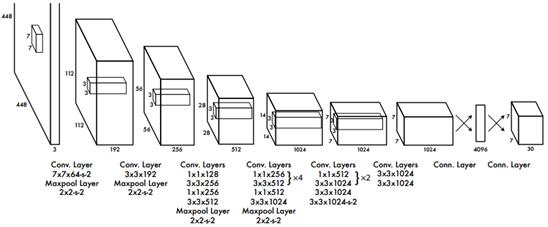
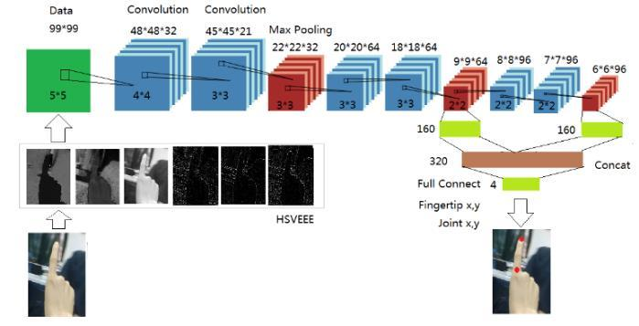

# Hand-Gesture-Control-Of-Robots
### Controlling a Omni-Whell tripod using Hand Movement

Finger Tip detection in Egocentric Videos using Deep Learning

For real implementation please take a look at this [paper](https://arxiv.org/pdf/1511.02282.pdf)

## Dependencies

Python 2.7, Tensorflow 1.1.0, Numpy 1.13.0, OpenCV 2.4.11, PySerial
Arduino IDE and [L298N](https://github.com/AndreaLombardo/L298N) library 

### Installation Procedure

Just run this command to get installations in place. Note you have to use `./flow` to use darkflow if you install this way. This installation procedure in advised since this is what is used in final application for bot control.  
```{python}
python2 setup.py build_ext --inplace
```
Refer [Darkflow](https://github.com/thtrieu/darkflow) to install darkflow in your computer.

Keep the pre-trained model weights in the `ckpt` folder. The link to the pre-trained model weights are [here](https://drive.google.com/open?id=0B-fJF0BpWK9teDRQajVORW55bkU)

To use your Web-Cam to receive images and use it to test YOLO
```{shell}
./flow --demo camera --model cfg/tiny-yolo-voc-hand.cfg --load 8875 --gpu 
```
## Running Application

If you are using Arduino to control the bot, you must upload the arduino program and then run the next command. (Note that the arduino must be connected to the laptop so that the commands can be sent to arduino serially)

Also since it is known that arduino is not capable of heavy computation and floating point arithmetic calculations, the computational burden of neural network is taken by the computer and just `control codes` are sent to arduino so that it can execute hard-coded algorithms for each and every control code it receives. It also enables the user to add more and more complex actions to the by manipulating this appliaction code (`app_arduino.py`) and correspondingly hard-code the control signals for that corresponding control code that is being sent to the arduino in `arduino_tr.ino`.

For example, if you want to add a new action that bot should perform if the hand moves in certain way, you must wrtie a code that detects that sort of movements (using the outputs of YOLO and bounding box regressor) in `app_arduino.py` and then send a control code (Serial.write()) to arduino and in `arduino_tr.ino` write the action it must perform.

```{python}
python app_arduino.py --checkpoint ./dataset/WIDER_train/checkpoint_bbox/model-7600 --gpu 0.99
```
This command will execute the program that integrates Hand-detection(YOLO), Bounding Box Regressor and sends control codes to arduino also. This uses your Web-Cam as the camera to get inputs. If you want you can connect external camera and get inputs from that. 

## Using Go-Pro to get input images
The programs `gpro_int.py` and `goprocv2.py` precisely do the same. We tried it using GoPro Hero 5 Black and we obtained the images from the camera.

* Switch on the CaptureApp in GoPro via ConnectDevice option.
* Connect your Laptop to the Wi-Fi from GoPro using the credentials displayed

Execute the following commands simultaneously

```{python}
python gpro_int.py
python goprocv2.py
```
From `goprocv2.py` you can obtain the frames and feed it into the `app_arduino.py`. 

We found this to extermely lagging and not at all suitable for realtime hand gesture communication. Any developement in this regard we love to hear!!

## Architecture

We used a Yolo V1 model to detect hands in the image. 



The detected hand was cropped and then fed into a bounding box regressor model that predicted the index finger tip coordinates given image of the cropped hand. The two models were trained separately and then cascaded to get the overall results(End to End learning is still a possible option to try out).  



## Further Improvements

The models can be trained further for better performence, End-to-End learning is a thing to explore. One can also try hand detection using more powerful models (YOLOV2, YOLO9000). The present dataset for bounding box regressor has severe bias for top left corner side (Employ methods in data augmentation to reduce this). Reduce latency time in arduino transmission and optimize program running time to get good real-time performance. As of now, arduino must be connected through a wire to the computer to get serial input. You could try wireless transmission using Wifi (advised) or bluetooth (limits the amount of data you can send). 

## Credits

We would like to thank Darkflow for their YOLO (tensorflow version) implentation.
